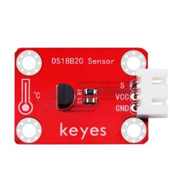
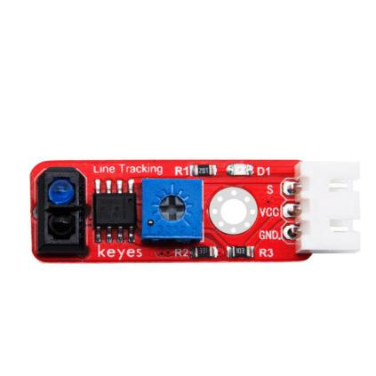

# 1. 产品介绍

Keyes brick 24合一传感器套装

## 1.1 产品介绍

Keyes brick 24合一传感器套装主要包含了我们常用的24款传感器/模块，还有对应的keyes UNO R3开发板、传感器扩展板和连接线。24款传感器/模块上都带有防反接口，和我们提供的传感器扩展板接口完全匹配。使用时，我们只需要将传感器扩展板堆叠在keyes UNO R3开发板，利用1根自带的连接线将传感器/模块连接在扩展板上，简单方便。

为了让你对这个24款传感器/模块有更深入的了解，我们还基于这个24款传感器/模块做个多个学习课程。这些课程是利用米思齐软件平台制作的，课程中我们提供了对应的接线方法、图形化编程代码、实验结果和简单的代码介绍等信息。通过这些课程，可以让我们对编程方法、逻辑有了更深刻的理解。

## 1.2 清单

| 序号 | 名称                                                    | 数量 | 图片                                   |
| ---- | ------------------------------------------------------- | ---- | -------------------------------------- |
| 1    | keyes brick LED红发红模块(焊盘孔) 防反插白色端子        | 1    |  |
| 2    | keyes brick 插件RGB模块(焊盘孔) 防反插白色端子          | 1    |  |
| 3    | keyes brick 热敏电阻传感器(焊盘孔) 防反插白色端子       | 1    |  |
| 4    | keyes brick 无源蜂鸣器模块(焊盘孔) 防反插白色端子       | 1    |  |
| 5    | keyes brick 霍尔传感器(焊盘孔) 防反插白色端子           | 1    |  |
| 6    | keyes brick 敲击模块传感器(焊盘孔) 防反插白色端子       | 1    |  |
| 7    | keyes brick 18B20温度传感器(焊盘孔) 防反插白色端子      | 1    |  |
| 8    | keyes brick 18B20温度传感器(焊盘孔) 防反插白色端子      | 1    |  |
| 9    | keyes brick LED黄发黄模块(焊盘孔) 防反插白色端子        | 1    |  |
| 10   | keyes brick 光敏电阻传感器(焊盘孔) 防反插白色端子       | 1    |  |
| 11   | keyes brick 可调电位器模块(焊盘孔) 防反插白色端子       | 1    |  |
| 12   | keyes brick 避障传感器(焊盘孔) 防反插白色端子           | 1    |  |
| 13   | keyes brick 按键传感器(焊盘孔) 防反插白色端子（配黄帽） | 1    |  |
| 14   | keyes brick 干簧管(焊盘孔) 防反插白色端子               | 1    |  |
| 15   | keyes brick DHT11温湿度传感器(焊盘孔) 防反插白色端子    | 1    |  |
| 16   | keyes brick 激光头传感器模块(焊盘孔) 防反插白色端子     | 1    |  |
| 17   | keyes brick 3W LED模块(焊盘孔) 防反插白色端子           | 1    |  |
| 18   | keyes brick 麦克风声音传感器(焊盘孔) 防反插白色端子     | 1    |  |
| 19   | keyes brick 有源蜂鸣器模块焊盘孔) 防反插白色端子        | 1    |  |
| 20   | keyes brick 巡线传感器(焊盘孔) 防反插白色端子           | 1    |  |
| 21   | keyes brick 倾斜模块传感器(焊盘孔) 防反插白色端子       | 1    |  |
| 22   | keyes brick 碰撞传感器(焊盘孔) 防反插白色端子           | 1    |  |
| 23   | keyes brick LM35温度传感器(焊盘孔) 防反插白色端子       | 1    |  |
| 24   | keyes brick 5V 单路继电器模块(焊盘孔) 防反插白色端子    | 1    |  |
| 25   | keyes UNO R3 for arduino 开发板 红色 环保               | 1    |  |
| 26   | Keyes brick shield 传感器扩展板 防反插白色端子          | 1    |  |
| 27   | 3P 双头XH2.54插头 L=200mm 白色                          | 10   |  |
| 28   | 4P 双头XH2.54插头 L=200mm 白色                          | 2    |  |
| 29   | 5P 双头XH2.54插头 L=200mm 白色                          | 2    |  |
| 30   | AM/BM 透明蓝 OD:5.0 L=50cm 环保                         | 1    |  |

## 1.3 介绍keyes UNO R3开发板

我们先看一下他的特写：

我们通过下面的图来了解一下这个开发板的各个接口和主要元器件。

芯片简介

- 1 ATMEGA328P-AU

- 7 Atmega16U2

- USB转串口芯片

- 9 AMS1117
- 5V稳压芯片

接口简介

- 2 ICSP接口：给ATMEGA328P-AU烧录固件接口
- 3 数字口D0-D13

- 串口通信：D0(RX)和D1(TX)

- 外部中断：D2（中断0）和D3（中断1）

- PWM口：D3、D5、D6、D9、D10和D11

- SPI通信：D10(SS)、D11(MOSI)、D12(MISO)和D13(SCK)

- LED:D13直接驱动标志“L”的LED

- 4 ICSP接口：给Atmega16U2烧录固件接口
- 6 USB接口：用于下载程序、串口调试和供电
- 10 DC电源接口：可接入7V-12V范围内电压
- 11 电源输出接口：输出3.3V或5V，常用于对外供电或进行共地处理
- 12 DC电源接口：可接入7V-12V范围内电压
- 13模拟口A0-A5

- IIC通信：A4(SDA)和A5（SCL）

- 也可当做数字口使用：A0(D14)、A1(D15)、A2(D16)、A3(D17)、A4(D18)和A5(D19)

器件简介

- 5 复位按键
- 8 16 MHz晶