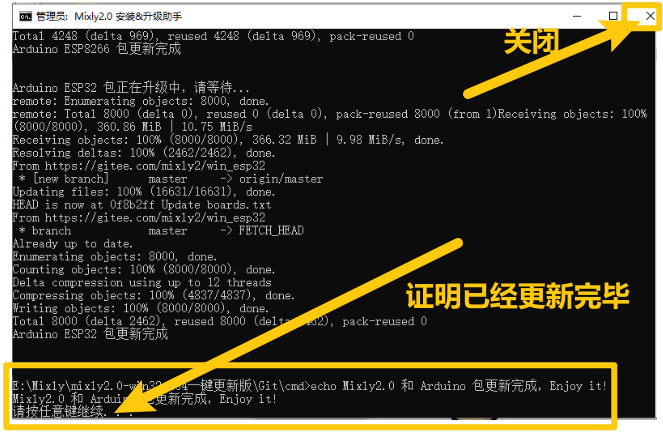
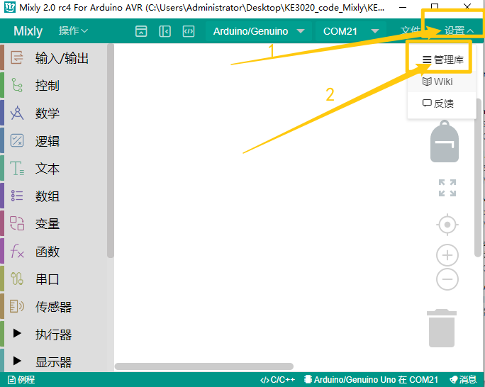

# 2. Mixly

## 2.1 资料下载

备用链接下载（百度网盘）： https://pan.baidu.com/s/1tJiKGUYVtE4VZKwZhCoy2w?pwd=jvmg

资料下载：[Mixly](./Mixly.7z)

## 2.2 软件安装

1. 下载压缩包，压缩包存放路径不要有中文

2. 解压压缩包，打开文件夹，打开。

3. 需要输入的地方全部输入“y”，等待更新即可。

4. 更新完毕后，关闭。

   

5.再次打开文件夹，可以看到软件已存在，点击打开。

## 2.3 软件介绍

1. 打开软件后，选择“Arduino AVR”.（要改）

2. 工具栏介绍

   

## 2.4 导入库文件

1. 点击“设置”---->“管理库”

   

   

2.选择本地导入，再选择所需的库文件，选择库文件中的“.xml”后缀的文件导入。

## 2.5 上传代码文件

1. 点击“文件”---->“打开”

2. 找到代码保存的位置，选择“.mix”文件，点击“确定”

3. 点击“上传”。

   

## 2.6 项目课程

拿到套件后，我们可以看到套件中有24款传感器/模块，有对应的keyes UNO R3开发板、传感器扩展板和连接线。这里，我们将24款传感器/模块利用自带连接线，单独连接在keyes UNO R3开发板和传感器扩展板。然后上传对应的测试代码，单独测试各个传感器/模块的功能。

特别注意：实验时，模块/传感器连接线材时，必须按照资料里的接线方法及位置，电源与信息脚不能错接，否则会损坏模块/传感器。

