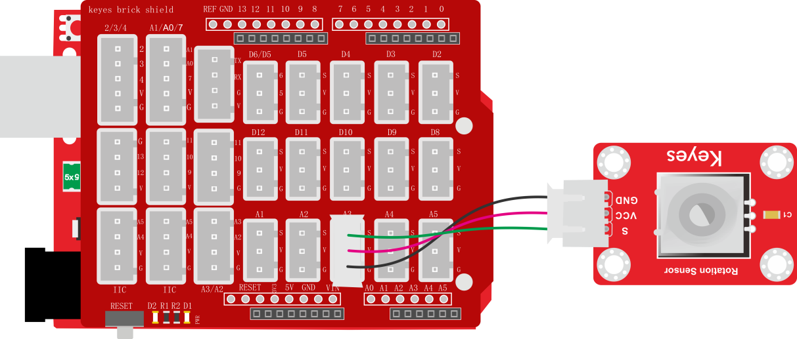
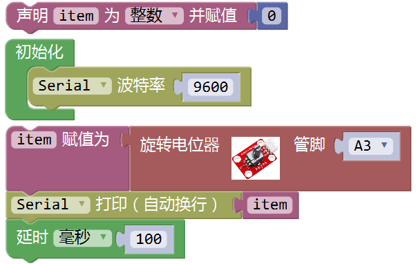
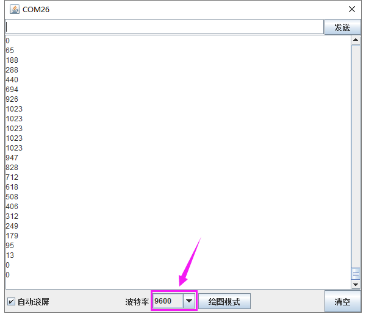

### 项目十 可调电位器模块读取模拟值

**1.实验说明**

在这个套件中，有一个keyes brick 可调电位器模块，它主要采用一个10K
可调电阻。通过旋转电位器，我们可以改变电阻大小，然后搭建电路将电阻变化转换为电压变化。

实验中，我们利用这个模块测试对应的模拟值；并且，我们在串口监视器上显示测试结果。

**2.实验器材**

- keyes brick 可调电位器模块\*1

- keyes UNO R3开发板\*1

- 传感器扩展板\*1

- 3P双头XH2.54连接线\*1

- USB线\*1

**3.接线图**

**4.测试代码**

**5.代码说明**

在实验中，需要在库文件的单元内，找到以下元件。

**6.测试结果**

上传测试代码成功，利用USB线上电后，打开串口监视器，设置波特率为9600。串口监视器显示对应模拟值。实验中，顺时针旋转电位器，模拟值增大，逆时针旋转电位器，模拟值减小，范围为0-1023，如下图。

