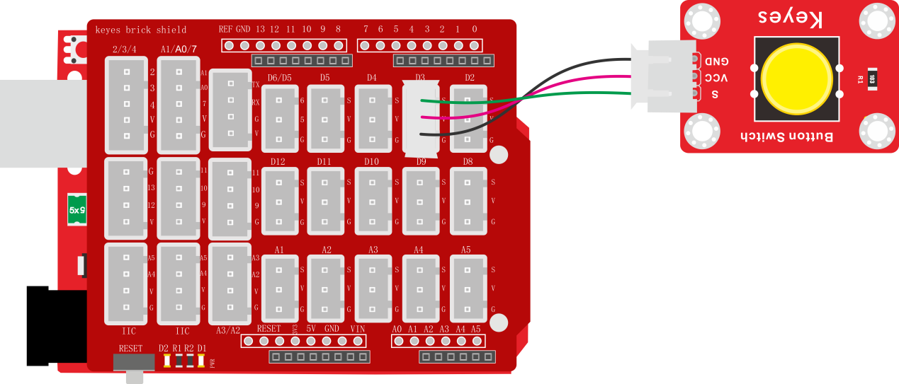
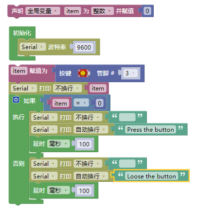
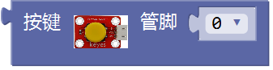
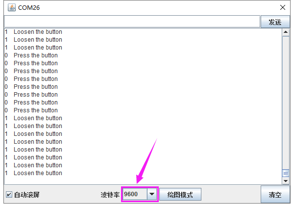

### 项目十二 按键传感器检测实验

**1.实验说明**

在这个套件中，有一个keyes brick按键传感器，它主要采用1个轻触开关，自带1个黄色按键帽。当我们按下按键时，传感器信号端为低电平；松开按键时，信号端为高电平。

实验中，我们通过读取传感器上S端高低电平，判断传感器上按键是否按下；并且，我们在串口监视器上显示测试结果。

**2.实验器材**

- keyes brick按键传感器\*1

- keyes UNO R3开发板\*1

- 传感器扩展板\*1

- 3P双头XH2.54连接线\*1

- USB线\*1

**3.接线图**

**4.测试代码**

**5.代码说明**

在实验中，我们需要在库文件的  单元内，找到以下元件。

**6.测试结果**

上传测试代码成功，利用USB线上电后，打开串口监视器，设置波特率为9600。串口监视器显示对应数据和字符。实验中，当传感器按下按键时，item为0，串口监视器显示“Press the button”字符；松开按键时，item为1，串口监视器显示“Loosen the button”字符，如下图。

