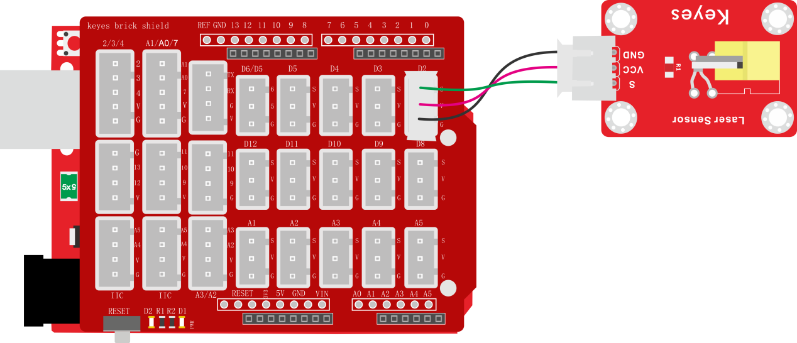

### 项目十五 激光头传感器模块检测实验

**1.实验说明**

在这个套件中，有一个keyes brick DHT11激光头传感器模块，它主要由1个铜材半导体激光管元件组成。控制时，我们需要在模块S端输入高电平信号，模块开始工作，激光管发射出红色激光信号。

实验中，我们只是控制这个传感器模块上的激光头循环发射激光。

**2.实验器材**

- keyes brick 激光头传感器模块\*1

- keyes UNO R3开发板\*1

- 传感器扩展板\*1

- 3P双头XH2.54连接线\*1

- USB线\*1

**3.接线图**

**4.测试代码**

**5.代码说明**

1. 在实验中，需要在库文件   的单元内，找到以下元件。

2. 我们把管脚设置为2，设置为高时，模块上激光发射；设置为低时，模块上激光停止发射。

**6.测试结果**

上传测试代码成功，上电后，模块上激光发射1秒，停止发射1秒，循环交替。