### 项目二 插件RGB模块调节RGB LED颜色

**1.实验说明**

在这个套件中，有一个插件RGB模块，它采用F5-全彩RGB雾状共阴LED元件。控制时，我们需要将模块R G
B连接单片机PWM口，-接GND。我们通过调节3个PWM值，控制LED元件显示红光、绿光和蓝光的比例，从而控制RGB模块上LED显示不同颜色灯光。当设置的PWM值越大，对应显示的颜色比例越重。理论来说，通过调节这3中颜色光的混合比例，可以模拟出所有颜色的灯光。

实验中，我们通过测试代码，控制模块上RGB LED显示几个常用颜色。

**2.实验器材**

- keyes brick 插件RGB模块\*1

- keyes UNO R3开发板\*1

- 传感器扩展板\*1

- 4P 双头XH2.54连接线\*1

- USB线\*1

**3.接线图**

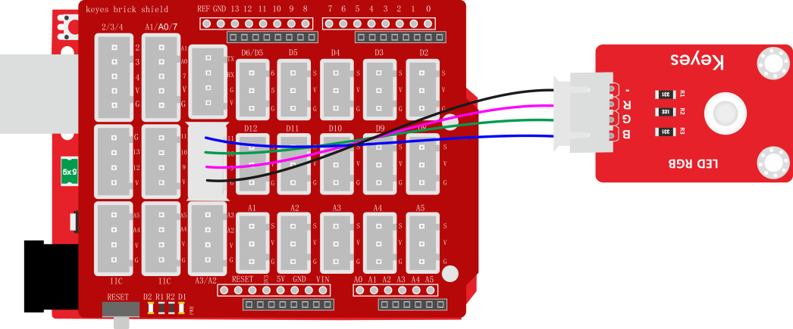

**4.测试代码**

代码1：

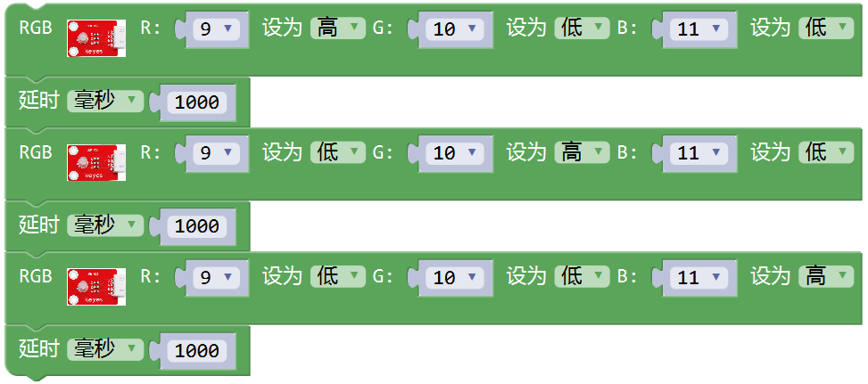

代码2：

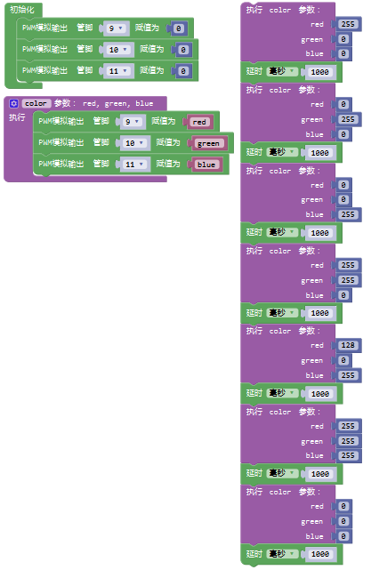

**5.代码1说明**

1. 代码1中，我们利用了库文件中设置方法，中R     G B代表控制模块上LED对应的红绿蓝3种颜色对应的端口，根据接线图我们接到了D9 D10     D11，设置为9 10 11，后面设置对应高低电平，设置GRB     LED中红绿蓝3个灯是否会亮，不能任意调节比例。

2. 现在观察代码，这个代码非常简单，只是简单的控制模块上RGB LED显示红色1秒、绿色1秒、蓝色1秒，循环交替。

**6.代码2说明**

1. 初始化 时设置D9 D10 D11的PWM值为0，熄灭模块上RGB LED。
2. 开始设置一个子程序，找到函数选项，找到项，选择使用该单元。点击标志设置子程序框架，将拉入，连续拉入3个该单元；点击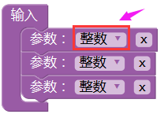设置3个参数类型，我们都设置为整数，点击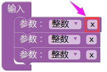设置参数名称；子程序框架设置成功，显示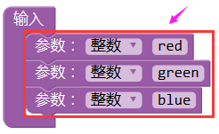，点击标志，退出子程序框架设置。设置完后，我们可以在单元中，找到设置的3个名称的参数。
3. 设置框架成功后，显示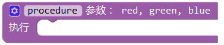，点击，设置子程序名称，我们设置为color。
4. 子程序框架名称设置成功后，我们就开始设置子程序。根据接线，我们D9控制RGB     LED显示红光，D10控制RGB LED显示绿光，D11控制RGB     LED显示蓝光。我们利用这3个PWM口的PWM值控制RGB     LED显示不同颜色。控制对应的PWM值越大，对应显示的颜色比例越重。因此，子程序我们设置为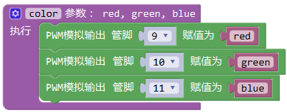
5. 子程序设置成功后，我们就可以在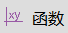中找到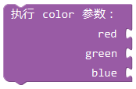，这里我们通过设置这3个参数，控制模块上RGB  LED显示不同颜色、亮度，理论来说，可以设置RGB     LED显示所有颜色，总共有255\*255\*255种排列组合。
6. 设置时，如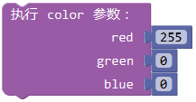表示使RGB LED显示最亮的红色。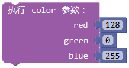表示使RGB LED显示紫色。

**7.测试结果**

上传测试代码1成功，上电后，模块上RGB LED循环显示红绿蓝3种颜色，间隔时间为1秒。上传测试代码2成功，上电后，模块上RGB LED显示红绿蓝黄紫白6种颜色，然后熄灭，循环不止，间隔时间为1秒。