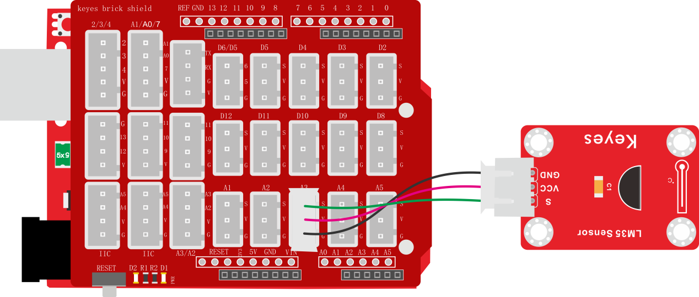
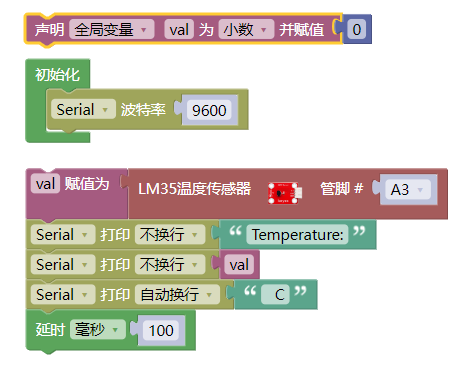
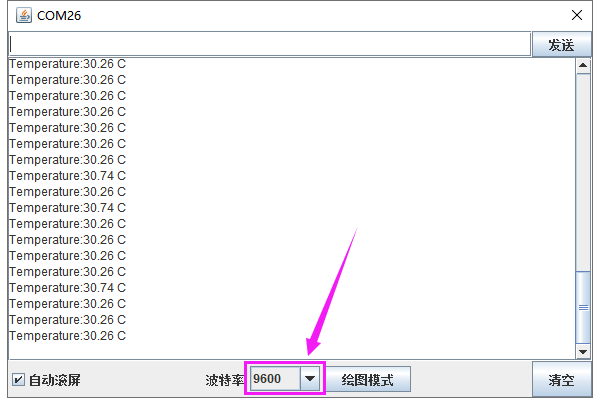

### 项目二十一 测试当前温度

**1.实验说明**

在这个套件中，有一个keyes brick LM35温度传感器，它主要采用LM35DZ传感器元件。该元件的输出电压与摄氏温标呈线性关系，转换公式如式，0时输出为0V，每升高1℃，输出电压增加10mV。

实验中，我们利用这个传感器测试当前环境中温度的大小；并且，我们在串口监视器上显示测试结果。

**2.实验器材**

- keyes brick LM35温度传感器\*1

- keyes UNO R3开发板\*1

- 传感器扩展板\*1

- 3P双头XH2.54连接线\*1

- USB线\*1

**3.接线图**

**4.测试代码**

**5.代码说明**

1. 在实验中，需要在库文件的单元内，找到以下元件。

2. 管脚设置为A3。
3. 设置1个小数变量val，将所测结果赋值给val。这val就是当前环境中的温度，在库文件中，已经添加了计算公式。
4. 串口监视器显示测试的温度值，显示前需设置波特率（我们默认设置为9600，可更改）。

**6.测试结果**

上传测试代码成功，利用USB线上电后，打开串口监视器，设置波特率为9600。串口监视器显示当前环境中的温度数值，如下图。

