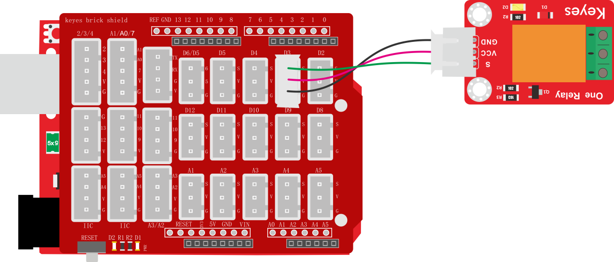

### 项目二十二 控制继电器开关

**1.实验说明**

在这个套件中，包含一个5V 单路继电器模块。它主要采用HK4100F-DC 5V-SHC继电器元件。继电器有3个绿色接线柱用于外接电路，分别为NO COM和NC端（背后丝印）。当继电器没有接控制信号时，COM端和NC端连通，COM端和NO端断开。

控制时，我们把GND接单片机GND，VCC接单片机5V,S接单片机数字口。当S信号端设置为高电平时，继电器开启，继电器COM端和NC端断开，COM端和NO端连通；S信号端设置为低电平时，继电器关闭，继电器COM端和NC端连通，COM端和NO端断开。

实验中，我们只是控制继电器NO端和COM端循环连接和断开。

**2.实验器材**

- keyes brick 5V 单路继电器模块\*1

- keyes UNO R3开发板\*1

- 传感器扩展板\*1

- 3P双头XH2.54连接线\*1

- USB线\*1

**3.接线图**

**4.测试代码**

**5.代码说明**

1.在实验中，我们需要在库文件的单元内，找到以下元件。

2. 我们把管脚设置为3，设置为高时，继电器上NO端和COM端连接，NC端和COM端断开；设置为低时，继电器上NO端和COM端断开，NC端和COM端连接。

**6.测试结果**

上传测试代码成功，上电后，模块上NO端和COM端连接1秒，断开1秒，循环交替。