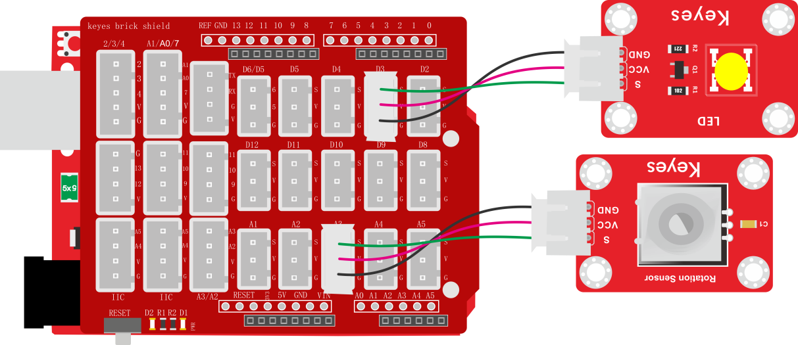
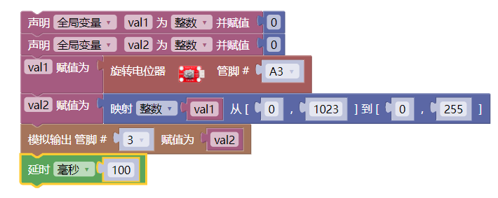

### 项目二十三 电位器调节灯光亮度

**1.实验说明**

在前面课程中，我们学习了利用代码调节LED模块上LED亮度的方法。学习利用可调电位器读取模拟值的方法。两个组合，我们利用可调电位器读取到的模拟值控制LED的亮度。设计代码时，模拟值的范围是0-1023；LED的亮度是由PWM值控制，范围为0-255。在这里，我们就需要用到映射功能，将0-1023数值映射到0-255。

设置成功后，我们就可以通过旋转电位器，控制模块上LED的亮度。

**2.实验器材**

- keyes brick LED模块\*1

- keyes brick 可调电位器模块\*1

- keyes UNO R3开发板\*1

- 传感器扩展板\*1

- 3P 双头XH2.54连接线\*2

- USB线\*1

**3.接线图**

**4.测试代码**

**5.代码说明**

实验中，主要新增的知识点就是映射功能

将val1从范围0-1023映射到0-255，并赋值给val2。

**6.测试结果**

上传测试代码成功，上电后，旋转模块上电位器，就可以调节LED模块上的LED的亮度。