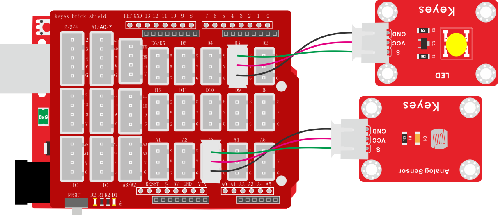
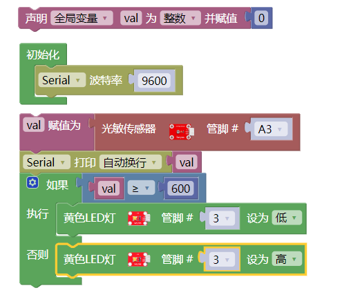
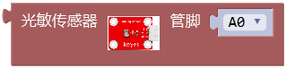
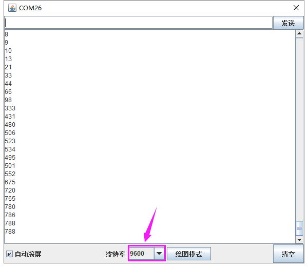

### 项目二十四 模拟户外灯

**1.实验说明**

在生活中我们可以看到户外有很多公共灯光。这些灯白天不亮，一到晚上，阳光暗下的时候，自动亮起；当阳光变亮时，这些灯就自动关闭。难道是有人在手动控制这些灯光？实际上不是的，实际上这些灯光上都安装有光敏传感器，这些传感器将外界阳光的亮暗，转换成对应数值。然后设置一个临界点，当超过临界点时，控制灯光熄灭，没有超过时，控制灯光亮起。

在这个实验中，我们利用套件中自带的光敏电阻传感器和LED模块模拟这一现象。

**2.实验器材**

- keyes brick 光敏电阻传感器\*1

- keyes brick LED模块\*1

- keyes UNO R3开发板\*1

- 传感器扩展板\*1

- 3P 双头XH2.54连接线\*2

- USB线\*1

**3.接线图**

**4.测试代码**

**5.代码说明**

1. 在实验中，我们需要在库文件的单元内，找到以下元件。

2. 其他设置变量，控制设置，以及串口通信，我们都在前面课程中介绍了。可以参考第四章节的实验三和实验五。

**3.测试结果**

上传测试代码成功，利用USB线上电后，打开串口监视器，设置波特率为9600。串口监视器显示对应模拟值。实验中，我们把光敏电阻传感器用手握住，数据变小，小于600时，LED模块上LED亮起，否则熄灭。

