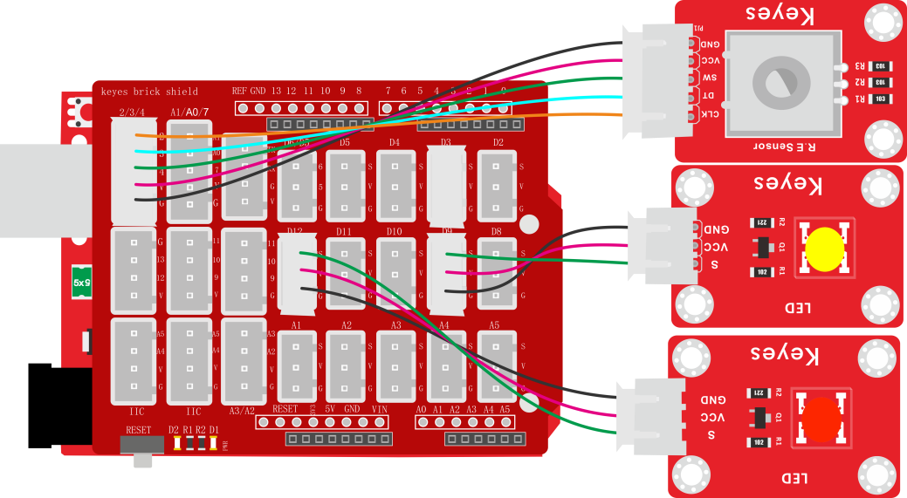
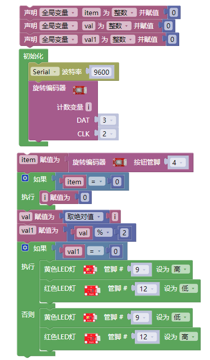

### 项目二十五 旋转编码器模块控制2个灯

**1.实验说明**

在前面课程的实验七中，我们利用旋转编码器计数。在这里我们将它扩展下，通过得出的计数，我们用来控制2个LED模块上LED的亮灭。

设计代码时，我们需要对所得数据取绝对值。然后我们将数据除以二，得到余数，余数为0控制一个模块上LED亮，余数为1，另一个模块上LED亮。

**2.实验器材**

- keyes brick 旋转编码器模块\*1

- keyes UNO R3开发板\*1

- keyes brick LED模块\*2

- 传感器扩展板\*1

- 5P双头XH2.54连接线\*1
- 3P 双头XH2.54连接线\*2

- USB线\*1

**3.接线图**

**4.测试代码**

**5.代码说明**

1. 在实验中，在找到，然后改为，即可设计对i取绝对值。
2. 在实验中，在找到，将+改成%，设置，即将val1设置为val除以2的余数。

**测试结果**

上传测试代码成功，按照接线图接好线，上电后，旋转编码器，即可控制外接的2个LED模块上的LED的亮灭。