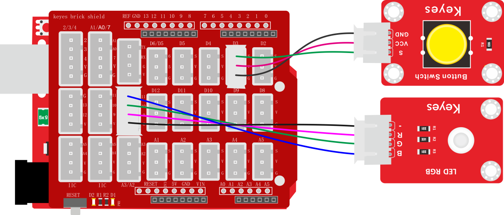
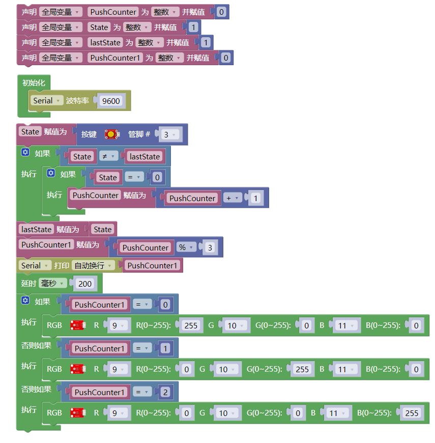
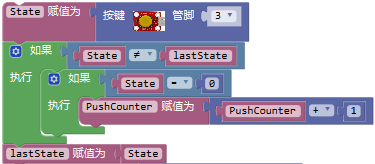
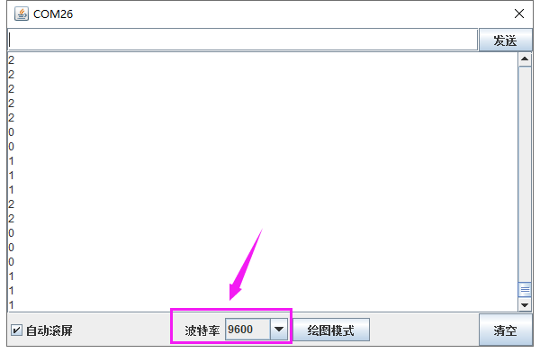

### 项目二十六 按键控制RGB灯

**1.实验说明**

在前面课程中，我们利用旋转编码器计数然后控制两个LED灯。在这一课程中，我们做一个扩展，我们利用代码，计算出按下模块上按键的次数。然后我们将所得数据除以三，所得余数为0 1 2三种。然后通过不同的余数，控制RGB模块上LED显示不同的颜色。

这样，我们就可以通过不断的按下按键，任意调节RGB模块上LED显示不同颜色了（三种颜色）。

**2.实验器材**

- keyes brick 插件RGB模块\*1

- keyes UNO R3开发板\*1

- keyes brick 按键传感器\*1

- 传感器扩展板\*1

- 4P双头XH2.54连接线\*1

- 3P 双头XH2.54连接线\*1

- USB线\*1

**3.接线图**

**4.测试代码**

**5.代码说明**

1.；手按下一次传感器上按键后，和数据变为不相等；检测到一次为0，就会加1一次。

2. 当我们没有按下按键时，和数据都为1，按下按键次数不变，按键次数除以3的余数不变，RGB模块上LED显示的颜色也就不变。
3. 当我们长按按键时，和数据都为0，按下按键次数不变，按键次数除以3的余数不变，RGB模块上LED显示的颜色也就不变。
4. 当我们按下一次按键（按下后松开）时，为0，为1，按下按键次数加1，按键次数除以3的余数变化，RGB模块上LED显示的颜色改变一次。

**6.测试结果**

上传测试代码成功，按照接线图接好线，利用USB上电后，打开串口监视器，设置波特率为9600；串口监视器显示数据，不断按下按键，数据在0 1 2中变化。当为为0时，RGB模块上LED显示红色；当1时，RGB模块上LED显示绿色；当为2时，RGB模块上LED显示蓝色。

