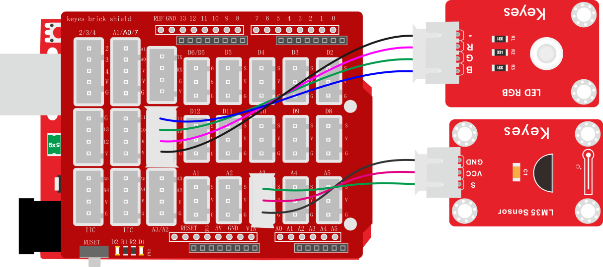
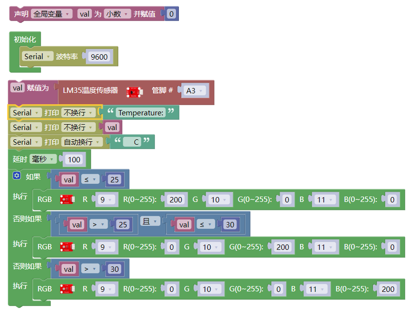
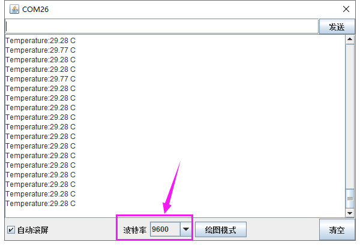

### 项目二十七 温度控制RGB灯

**1.实验说明**

在前面课程中，我们利用按键手动控制RGB模块上LED灯的颜色。在这一课程中，我们利用一个LM35温度传感器检测当前环境的温度。然后利用检测到的温度数据控制RGB模块上LED灯的颜色。

生活中，我们可以把这个电路设计应用到水杯中。我们利用温度传感器检测到水杯温度，控制水杯上LED的颜色。这样我们就可以通过LED颜色，判断水的大概温度。

**2.实验器材**

- keyes brick 插件RGB模块\*1

- keyes UNO R3开发板\*1

- keyes brick LM35温度传感器\*1

- 传感器扩展板\*1

- 4P双头XH2.54连接线\*1

- 3P 双头XH2.54连接线\*1

- USB线\*1

**3.接线图**

**4.测试代码**

**5.代码说明**

检测到温度数据后通过设置控制RGB模块上的LED颜色。

**6.测试结果**

上传测试代码成功，按照接线图接好线，利用USB上电后，打开串口监视器，设置波特率为9600；串口监视器显示当前环境中温度数值。当温度小于等于25℃时，RGB模块上的LED显示红色；当温度大于25℃且小于等于30℃时，RGB模块上的LED显示绿色；当温度大于30℃时，RGB模块上的LED显示蓝色。

