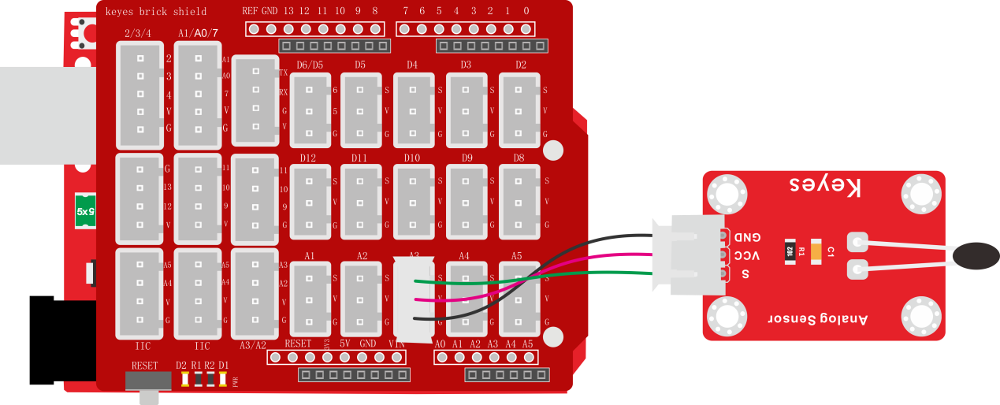
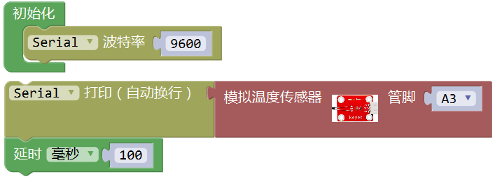
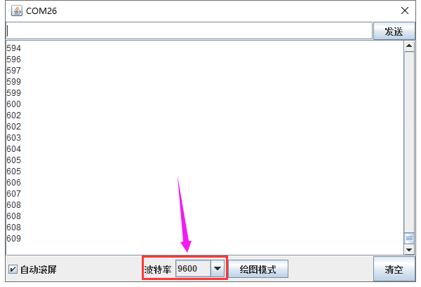

### 项目三 热敏电阻传感器简单测试

**1.实验说明**

在这个套件中，有一个热敏电阻传感器，它主要采用NTC-MF52AT热敏电阻元件。NTC-MF52AT热敏电阻元件能够时感知周边环境温度的变化，电阻大小随着温度的变化而变化。该传感器就是利用NTC-MF52AT热敏电阻元件这一特性，搭建电路将电阻变化转换为电压变化。

实验中，我们将传感器信号端接到keyes UNO R3开发板模拟口，读出对应的模拟值。我们可以利用模拟值，通过特定公式，计算出当前环境的温度。由于温度计算公式比较复杂，这里就不多介绍了。实验中，我们只是读取对应的模拟值。

**2.实验器材**

- keyes brick 热敏电阻传感器\*1

- keyes UNO R3开发板\*1

- 传感器扩展板\*1

- 3P 双头XH2.54连接线\*1

- USB线\*1

**3.接线图**

**4.测试代码**

**5.代码说明**

1. 在单元找到，设置波特率为9600，我们可

以更改9600，设置各种波特率。

2. ，是指将模拟温度传感器信号端接在A3，读取A3端的模拟值，在串口监视器上显示，没显示一次新数据，自动换一行显示。
3. 为了方便观察数据，后面加个延迟100毫秒。

**6.测试结果**

上传测试代码成功，利用USB线上电后，打开串口监视器，设置波特率为9600。串口监视器显示对应的模拟值，温度越高，模拟值越大。

