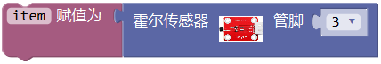

### 项目五 霍尔传感器检测磁场

**1.实验说明**

在这个套件中，有一个霍尔传感器，它主要采用A3144霍尔元件。该元件是由电压调整器、霍尔电压发生器、差分放大器、史密特触发器，温度补偿电路和集电极开路的输出级组成的磁敏传感电路，其输入为磁感应强度，输出是一个数字电压讯号。它是单极开关型的霍尔传感器，只感应南极磁场。传感器感应到无磁场或北极磁场时，信号端为高电平；感应到南极磁场时，信号端为低电平。当感应磁场强度越强时，感应距离越长。

实验中，我们利用霍尔传感器检测南极磁场，将测试结果在串口监视器上显示。

**2.实验器材**

- keyes brick 霍尔传感器\*1

- keyes UNO R3开发板\*1

- 传感器扩展板\*1

- 3P 双头XH2.54连接线\*1

- USB线\*1

**3.接线图**

**4.测试代码**

**5.代码说明**

1. 在单元找到，选择“全局变量”，设置item初始变亮为整数，并赋值为0，。

2. 初始化设置波特率为9600。

3. 同样，可以在的单元找到，管脚我们同样设置为3。我们将读取到D3读取到的数字值赋值给item，

4. 在单元内，找到点击进行设置，我们可以在里面任意添加 如果否则 否则逻辑单元，如下图。

   

   

我们实验中，只需要添加一个否则单元，设置完成后点击，完成设置。

5. 代码逻辑是传感器感应到南极磁场时，信号端为低电平，D3口为低电平，即item为0。这时我们在串口监视器显示对应的数字值和字符；否则（传感器感应到无磁场或北极磁场时），item为1，窗口监视器显示1和另外的字符。

**6.测试结果**

上传测试代码成功，利用USB线上电后，打开串口监视器，设置波特率为9600。当传感器感应到南极磁场时，传感器监视器显示如图1；当传感器感应到无磁场或北极磁场时，串口监视器显示如图2。

