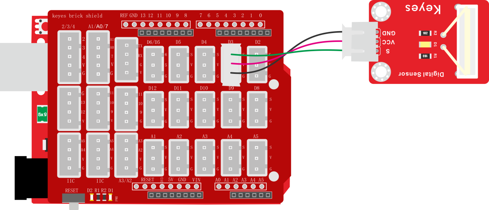
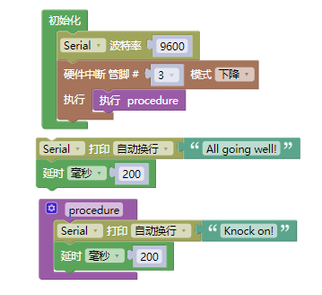
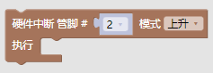
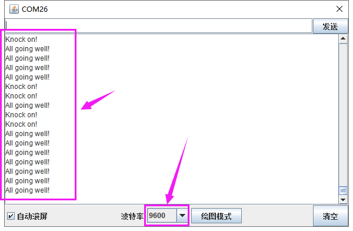

### 项目六 敲击模块传感器检测状态

**1.实验说明**

在这个套件中，有一个敲击模块传感器，它主要采用SW-2802振动开关元件。SW-2802振动开关元件是弹簧型震动感应触发开关。该振动开关在静止時为开路OFF状态，
当受到外力碰触而达到相应震动力时,或移动速度达到适当离(偏)心力时，导电接脚会产生瞬间导通呈瞬间ON状态;当外力消失時,开关恢复为开路OFF状态。该传感器就是利用元件这一特性，搭建电路将震动信号转换为高低电平变换信号。

实验中，我们利用敲击模块传感器检测敲击状态，将测试结果在串口监视器上显示。

**2.实验器材**

- keyes brick 敲击模块传感器\*1

- keyes UNO R3开发板\*1

- 传感器扩展板\*1

- 3P 双头XH2.54连接线\*1

- USB线\*1

**3.接线图**

**4.测试代码**

**5.代码说明**

1. 在这一实验中，我们主要接触到的新知识是中断知识。keyes UNO R3开发板的中断口是数字口2和数字口3，我们把信号端设置在数值口3了。
2. 我们在找到，设置管脚为3，有3中模式：上升、下降和改变。没有敲击时，传感器信号端为高电平，感受到敲击信号，传感器信号端变为低电平；因此我们设置为下降。
3. 中断设置为，就是说，传感器感应到敲击信号，中断口3下降，执行子程序，否则执行循环程序。

**6.测试结果**

上传测试代码成功，利用USB线上电后，打开串口监视器，设置波特率为9600。当传感器敲击信号时，传感器监视器显示“Knock on!”字符；否则显示“All going well!”字符，如下图。

