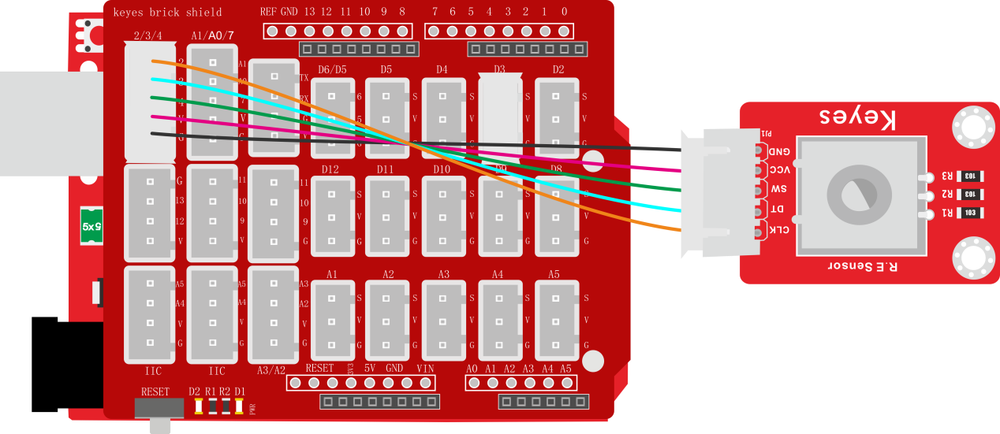
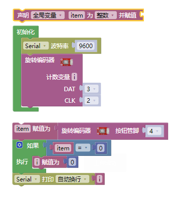
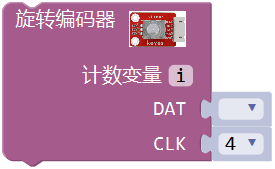
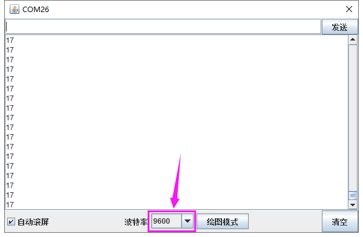

### 项目七 旋转编码器模块计数

**1.实验说明**

在这个套件中，有一个keyes brick旋转编码器模块，它主要采用20脉冲旋转编码器元件。它可通过旋转计数正方向和反方向转动过程中输出脉冲的次数，这种转动计数是没有限制的，复位到初始状态，即从0开始计数。如果我们只计算信号的脉冲，则可以使用两个输出中的任何一个来确定旋转位置。但是，如果我们想要确定旋转方向，我们需要同时考虑两个信号。

实验中，我们利用keyes brick旋转编码器模块用于计数，当我们顺时针旋转编码器时，设置数据i加1；逆时针旋转编码器时，设置数据i减1；按下编码器中间按键时，设置数据i为0；将测试结果在串口监视器上显示。

**2. 实验器材**

- keyes brick 旋转编码器模块\*1

- keyes UNO R3开发板\*1

- 传感器扩展板\*1

- 5P双头XH2.54连接线\*1

- USB线\*1

**3.接线图**

**4.测试代码**

**5.代码说明**

1. 在实验中，我们需要在库文件的单元内，找到以下元件。

   

2.  我们把CLK设置为2、DAT设置为3。该代码在库文件中设置好了，它的意思是中断2（CLK）下降后，读取数字口3（DAT）电压，当DAT电压为高电平时，i加1；当DAT电压为低电平时，i减1。我们可以打开米思齐软件中的看到对应设置的C语言代码。
3. 然后循环程序中设置按钮管脚（D4）为低电平时，i设置为0。
4. 将i的数据在串口监视器中打印出来，设置串口打印时，必须在初始化中设置波特率。

**6.测试结果**

上传测试代码成功，利用USB线上电后，打开串口监视器，设置波特率为9600。顺时针旋转编码器，显示数据增加；逆时针旋转编码器，显示数据减小；按下编码器中间按键，显示数据为0，如下图。

