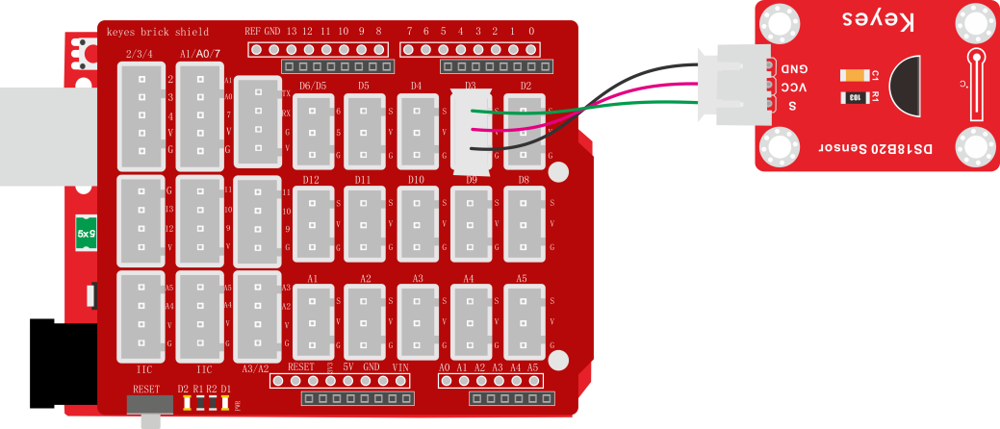
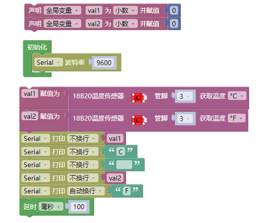
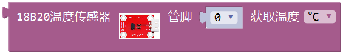
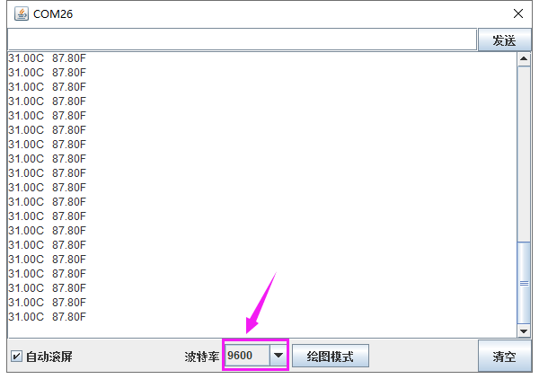

### 项目八 DS18B20温度传感器测试温度

**1.实验说明**

在这个套件中，有一个keyes brick 18B20温度传感器，它主要采用DS18B20传感器元件。我们可以利用该传感器测试当前环境中的温度。它的测量范围为－55℃～＋125℃，测量精度为±0.5℃（-10℃至+85℃范围内）。

实验中，我们利用这个温度传感器测试当前环境中的温度，测试结果分为℃和℉两种；并且，我们在串口监视器上显示测试结果。

**2.实验器材**

keyes brick 18B20温度传感器\*1

keyes UNO R3开发板\*1

传感器扩展板\*1

3P双头XH2.54连接线\*1

USB线\*1

**3.接线图**

**4.测试代码**

**5.代码说明**

1. 在实验中，我们需要在库文件的单元内，找到以下元件。

2. 我们把管脚设置为3，获取温度的单位分别设置为℃和℉。

3. 设置两个小数变量，分别为val1和val2，将所测结果赋值给val1和val2。

4. 串口监视器显示val1和val2的值，显示前需设置波特率（我们默认设置为9600，可更改）。

5. 显示时，我们在数据后面添加单位，如果单位直接设置为℃和℉，测试结果会出现乱码。所以我们直接用C代替℃，F代替℉。

**6.测试结果**

上传测试代码成功，利用USB线上电后，打开串口监视器，设置波特率为9600。串口监视器显示当前环境的温度，如下图。

