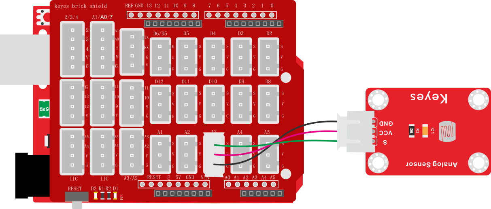
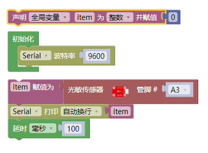
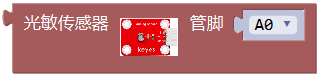
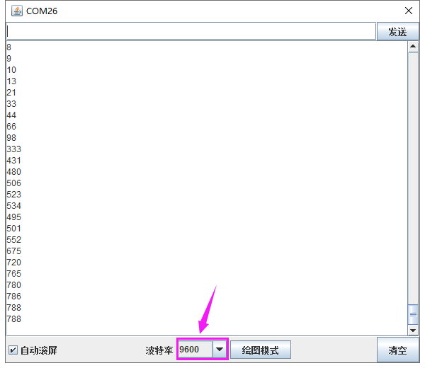

### 项目九 光敏电阻传感器测试光照强度

**1.实验说明**

在这个套件中，有一个keyes brick
光敏电阻传感器，它是一个常用的光敏电阻传感器，它主要采用光敏电阻元件。该电阻元件电阻大小随着光照强度的变化而变化，当环境中有亮光的时候，电阻大小为5-10KΩ；没有亮光时，电阻大小为0.2MΩ。该传感器就是利用光敏电阻元件这一特性，搭建电路将电阻变化转换为电压变化。

实验中，我们利用这个传感器测试当前环境中的光照强度对应的模拟值，光照越强，模拟值越大；并且，我们在串口监视器上显示测试结果。

**2.实验器材**

- keyes brick 光敏电阻传感器\*1

- keyes UNO R3开发板\*1

- 传感器扩展板\*1

- 3P双头XH2.54连接线\*1

- USB线\*1

**3.接线图**

**4.测试代码**

**5.代码说明**

1. 在实验中，需要在库文件的单元内，找到以下元件。

2. 把管脚设置为A3。
3. 设置1个整数变量item，将所测结果赋值给item。
4. 串口监视器显示item的值，显示前需设置波特率（我们默认设置为9600，可更改）。

**6.测试结果**

上传测试代码成功，利用USB线上电后，打开串口监视器，设置波特率为9600。串口监视器显示对应模拟值。实验中，我们把传感器用手握住，逐渐松开，光照逐渐变强，可以逐渐看到模拟值数据变大，如下图。

